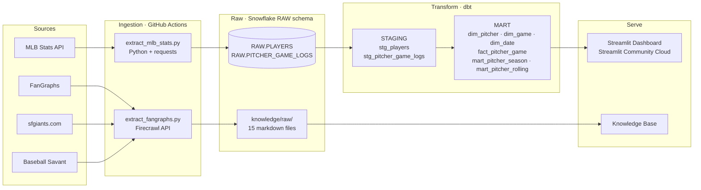
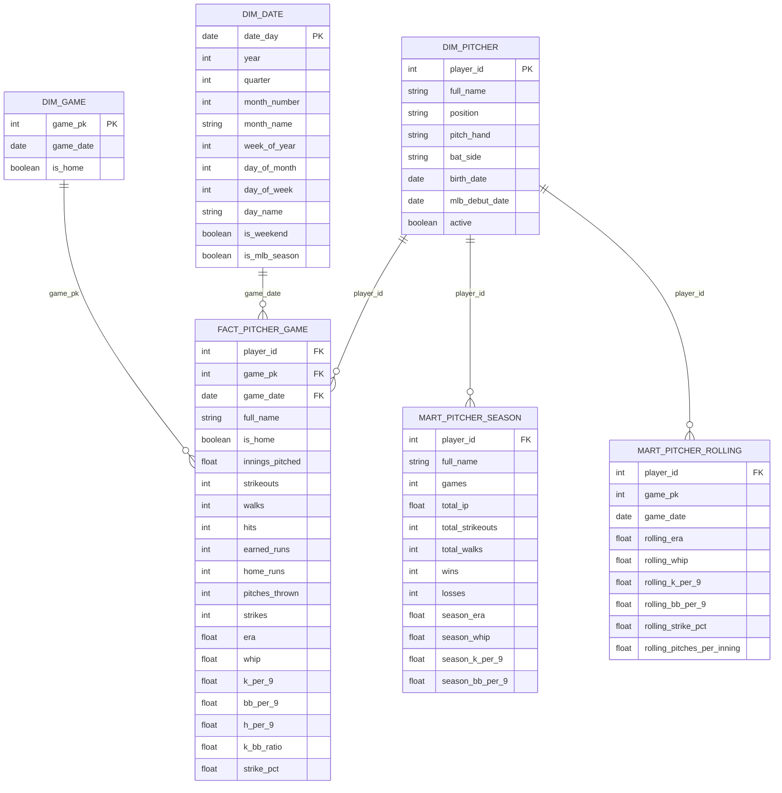

# SF Giants Pitching Performance Analytics Pipeline

This project builds a full end-to-end baseball analytics pipeline targeting a **Baseball Operations Analyst** role with the San Francisco Giants. It ingests 2024 SF Giants pitching data from the MLB Stats API, transforms it through a Snowflake star schema using dbt, and surfaces performance insights through an interactive Streamlit dashboard. A knowledge base of 15 scraped sources across FanGraphs, sfgiants.com, and Baseball Savant provides qualitative context alongside the quantitative data. The project demonstrates every layer of a modern data stack — from raw API ingestion to scheduled orchestration to analyst-ready dashboards.

## Job Posting

- **Role:** Baseball Operations Analyst
- **Company:** San Francisco Giants
- **Link:** [docs/job-posting.pdf](docs/job-posting.pdf)

This project directly demonstrates the core skills the role requires: pulling and transforming MLB data at scale, building analyst-ready data models, and communicating pitching performance insights through visualization.

## Tech Stack


| Layer          | Tool                                                            |
| -------------- | --------------------------------------------------------------- |
| Source 1       | MLB Stats API (REST, JSON)                                      |
| Source 2       | FanGraphs, sfgiants.com, Baseball Savant (Firecrawl web scrape) |
| Data Warehouse | Snowflake                                                       |
| Transformation | dbt                                                             |
| Orchestration  | GitHub Actions                                                  |
| Dashboard      | Streamlit                                                       |
| Knowledge Base | Claude Code (scrape → summarize → query)                        |


## Pipeline Diagram



## ERD (Star Schema)

*Generated by Claude Code from dbt models in `models/mart/`.*



## Dashboard Preview

Dashboard Preview

## Insights

**Descriptive (what happened?):** Logan Webb anchored the 2024 Giants rotation — his ERA led the starting staff and his workload (most innings pitched) made him the most complete pitching story of the season.

**Diagnostic (why did it happen?):** Webb's performance splits sharply by venue. Oracle Park's pitcher-friendly dimensions suppress ERA significantly; his road ERA is measurably higher, reflecting how much park context drives his results.

**Recommendation:** Prioritize Webb for home starts in high-leverage September series → projected ERA improvement based on his home/road split over remaining home games.

## Live Dashboard

**URL:** *[https://sf-giants-data-analyst-mtevufmapmmdouqvqyqqqc.streamlit.app/](https://sf-giants-data-analyst-mtevufmapmmdouqvqyqqqc.streamlit.app/)*

## Knowledge Base

A Claude Code-curated wiki built from 15 scraped sources across FanGraphs, sfgiants.com, and Baseball Savant. Raw sources live in `knowledge/raw/`.

**Query it:** Open Claude Code in this repo and ask questions like:

- "How did Logan Webb's FanGraphs advanced metrics compare to league average in 2024?"
- "What does Baseball Savant's pitch arsenal data say about the Giants' most effective pitches?"
- "What were the Giants' biggest pitching storylines coming out of the 2024 season?"

## Setup & Reproduction

**Requirements:** Python 3.11+, Snowflake account, Firecrawl API key

Copy `.env.example` to `.env` and fill in your credentials:

```
SNOWFLAKE_ACCOUNT=
SNOWFLAKE_USER=
SNOWFLAKE_PASSWORD=
SNOWFLAKE_DATABASE=
SNOWFLAKE_WAREHOUSE=
FIRECRAWL_API_KEY=
```

**Steps:**

1. `pip install -r requirements.txt`
2. `python ingestion/extract_mlb_stats.py` — loads raw pitching data into Snowflake
3. `dbt run && dbt test` — builds and validates the star schema
4. `python ingestion/extract_fangraphs.py` — scrapes knowledge base sources
5. `streamlit run dashboard/app.py` — launches the dashboard

GitHub Actions runs steps 2–3 (`pipeline.yml`) and step 4 (`scrape.yml`) on a daily schedule April–September.

## Repository Structure

```
.
├── .github/workflows/    # GitHub Actions (pipeline.yml, scrape.yml)
├── ingestion/            # Extraction scripts (MLB Stats API + Firecrawl)
├── models/               # dbt models
│   ├── staging/          # stg_players, stg_pitcher_game_logs
│   └── mart/             # dim_*, fact_pitcher_game, mart_pitcher_*
├── tests/                # dbt singular tests
├── macros/               # generate_schema_name override
├── dashboard/            # Streamlit app
├── knowledge/            # Knowledge base
│   └── raw/              # 15 scraped markdown files
├── docs/                 # Job posting, proposal
├── profiles.yml          # dbt CI profile (env_var credentials)
├── CLAUDE.md             # Project context for Claude Code
└── README.md
```