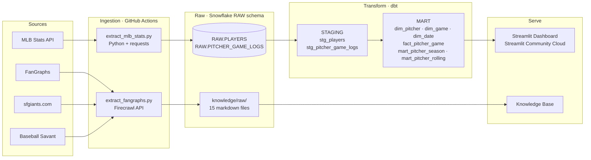
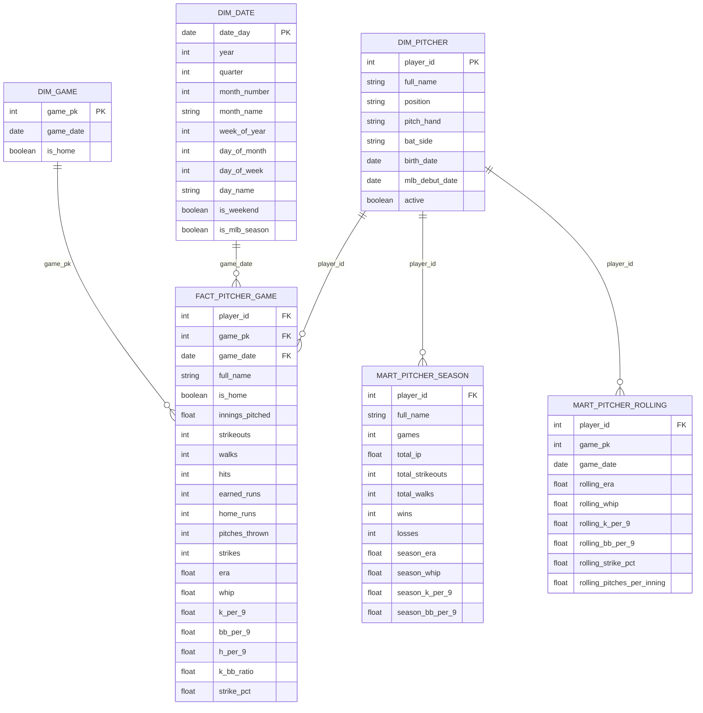

# SF Giants Pitching Performance Analytics Pipeline

This project builds a full end-to-end baseball analytics pipeline targeting a **Baseball Operations Analyst** role with the San Francisco Giants. It ingests the complete 2024 SF Giants pitching season from the MLB Stats API, transforms it through a Snowflake star schema using dbt, and surfaces performance insights through an interactive Streamlit dashboard. A knowledge base of 30 scraped sources across FanGraphs, Baseball Savant, Baseball Reference, and MLB.com provides qualitative context alongside the quantitative data. The project demonstrates every layer of a modern data stack — from raw API ingestion to warehouse transformation to analyst-ready dashboards.

## Job Posting

- **Role:** Baseball Operations Analyst
- **Company:** San Francisco Giants
- **Link:** [docs/job-posting.pdf](docs/job-posting.pdf)

This project directly demonstrates the core skills the role requires: pulling and transforming MLB data at scale, building analyst-ready data models, and communicating pitching performance insights through visualization.

## Tech Stack


| Layer          | Tool                                                            |
| -------------- | --------------------------------------------------------------- |
| Source 1       | MLB Stats API (REST, JSON)                                      |
| Source 2       | FanGraphs, sfgiants.com, Baseball Savant (Firecrawl web scrape) |
| Data Warehouse | Snowflake                                                       |
| Transformation | dbt                                                             |
| Orchestration  | GitHub Actions                                                  |
| Dashboard      | Streamlit                                                       |
| Knowledge Base | Claude Code (scrape → summarize → query)                        |


## Pipeline Diagram




---

## Pipeline Walkthrough

### Step 1 — MLB Stats API Ingestion (`ingestion/extract_mlb_stats.py`)

The first ingestion script pulls all SF Giants pitching data for the 2024 regular season from the MLB Stats API, a free public REST API at `https://statsapi.mlb.com/api/v1`. It runs in three sequential phases:

**Phase 1 — Roster fetch**
The script hits the `/teams/137/roster` endpoint (137 is the SF Giants team ID) with `rosterType=fullSeason` and `season=2024`. This returns every player on the full-season roster. The script filters that list down to pitchers only by checking `position.type == "Pitcher"`, yielding the 28-man pitching staff.

**Phase 2 — Player detail fetch**
For each pitcher ID returned by the roster, the script calls `/people/{player_id}` to pull biographical and positional data: full name, birth date, pitching hand, batting side, primary position, MLB debut date, and active status. Non-numeric API placeholders like `-.--` and `---` are cleaned to `None` before storage.

**Phase 3 — Game log fetch**
For each pitcher, the script calls `/people/{player_id}/stats` with parameters `stats=gameLog`, `group=pitching`, `season=2024`, and `gameType=R` (regular season only). This returns one row per game started or appeared in, with raw counting stats: innings pitched, strikeouts, walks, hits, earned runs, home runs, pitches thrown, strikes, wins, losses, ERA, WHIP, and whether the game was home or away.

**Load to Snowflake**
After extraction, the script connects to Snowflake and creates two raw tables if they don't already exist, then truncates and reloads them on every run:

- `RAW.PLAYERS` — 28 rows, one per pitcher, biographical data
- `RAW.PITCHER_GAME_LOGS` — 809 rows, one per pitcher per game appearance

Both tables include a `_loaded_at` timestamp so every load is auditable. The truncate-and-reload pattern means the raw layer always reflects the current state of the API.

---

### Step 2 — Knowledge Base Scraping (`ingestion/extract_fangraphs.py`)

The second ingestion script builds a qualitative knowledge base by scraping 15 pages from FanGraphs, sfgiants.com, and Baseball Savant using the Firecrawl API. Firecrawl handles JavaScript-rendered pages and returns clean markdown, stripping ads and navigation so only article content is saved.

**Sources scraped:**

- FanGraphs Giants pitching leaderboard (2024)
- FanGraphs individual player pages for Logan Webb, Kyle Harrison, Robbie Ray, Jordan Hicks, and Alex Cobb
- FanGraphs SF Giants team pitching page
- sfgiants.com news, roster, and homepage
- Baseball Savant Giants team pitching stats, Statcast glossary, Logan Webb player page, pitch arsenal leaderboard, and spin rate leaderboard

Each page is saved as a markdown file in `knowledge/raw/` with a frontmatter header containing the source URL and slug. A 2-second delay between requests prevents rate limiting. These files serve as the raw material for the Claude Code knowledge base, which can answer natural language questions about Giants pitching using the scraped content as context.

---

### Step 3 — dbt Staging Layer (`models/staging/`)

The staging layer is the first transformation step. Both staging models are materialized as **views** in the `STAGING` Snowflake schema, meaning they run as SQL queries at query time rather than persisting data. Their job is purely to clean and type-cast the raw tables — no business logic yet.

`**stg_players`**
Reads from `RAW.PLAYERS`. The main transformation is casting `birth_date` and `mlb_debut` from raw VARCHAR strings to proper DATE types using Snowflake's `TRY_TO_DATE()` function, which returns NULL instead of erroring on malformed values. All other columns are passed through as-is with clean names.

`**stg_pitcher_game_logs**`
Reads from `RAW.PITCHER_GAME_LOGS`. Casts `game_date` from VARCHAR to DATE, and explicitly casts `era`, `innings_pitched`, and `whip` to FLOAT since the MLB API can return these as strings. All counting stats (strikeouts, walks, hits, etc.) pass through unchanged.

**Schema routing**
A custom macro in `macros/generate_schema_name.sql` overrides dbt's default behavior. By default, dbt would prefix the target schema name onto any custom schema — producing `RAW_STAGING` instead of `STAGING`. The macro strips that prefix so models land in their intended schema: `RAW`, `STAGING`, or `MART` exactly.

---

### Step 4 — dbt Mart Layer (`models/mart/`)

The mart layer is materialized as **tables** in the `MART` Snowflake schema. This is where all business logic, metric computation, and aggregation happens. The mart layer follows a star schema design with one central fact table, three dimension tables, and two pre-aggregated mart tables.

`**dim_pitcher`**
A simple pass-through from `stg_players` that selects only the columns relevant to the pitching dimension: player ID, full name, pitching hand, batting side, position, birth date, MLB debut date, and active status. 28 rows, one per SF Giants pitcher.

`**dim_game**`
Derives the game dimension from `fact_pitcher_game` rather than a separate source. Since multiple pitchers can appear in the same game, it deduplicates by grouping on `game_pk` and `game_date` and taking `MAX(is_home)` to get one canonical home/away flag per game. 247 rows, one per unique game.

`**dim_date**`
A date spine generated entirely inside Snowflake using the `GENERATOR(rowcount => 4018)` function, producing a row for every day from January 1, 2020 through late 2030. Each row is enriched with year, quarter, month number, month name, week of year, day of month, day of week, day name, a weekend flag, and an MLB season flag (April–September). This dimension enables date-based filtering and aggregation across any time range without relying on the presence of game data for every date.

`**fact_pitcher_game**`
The central fact table. Joins `stg_pitcher_game_logs` to `stg_players` on `player_id` to attach the pitcher's full name, then computes five per-game rate statistics that aren't in the raw data:

- **K/9** — strikeouts per 9 innings: `(strikeouts / innings_pitched) × 9`
- **BB/9** — walks per 9 innings: `(walks / innings_pitched) × 9`
- **H/9** — hits per 9 innings: `(hits / innings_pitched) × 9`
- **K/BB ratio** — strikeouts divided by walks, a measure of command
- **Strike%** — strikes divided by total pitches thrown

All five are computed with NULL guards (`CASE WHEN innings_pitched > 0`) to avoid division-by-zero errors on games where a pitcher recorded no outs. The composite primary key is `(player_id, game_pk)`. 809 rows, one per pitcher per game.

`**mart_pitcher_season`**
Aggregates `fact_pitcher_game` to one row per pitcher for the full season. Computes season-level totals (games, IP, strikeouts, walks, hits, earned runs, home runs, wins, losses) and recalculates ERA, WHIP, K/9, and BB/9 from the season totals rather than averaging game-level values — this is the correct statistical approach since ERA must be computed from aggregate innings and earned runs. 28 rows, one per pitcher.

`**mart_pitcher_rolling**`
Computes 5-start rolling averages for every game in `fact_pitcher_game` using SQL window functions partitioned by `player_id` and ordered by `game_date`. The window frame `ROWS BETWEEN 4 PRECEDING AND CURRENT ROW` captures the current game plus the four most recent prior appearances for that pitcher, producing rolling ERA, WHIP, K/9, BB/9, strike percentage, and pitches per inning. This model powers the trend line charts in the dashboard. 809 rows — same grain as the fact table, with rolling columns added.

---

### Step 5 — dbt Tests (`models/staging/schema.yml`, `models/mart/schema.yml`, `tests/`)

25 tests validate the data at every layer. They fall into two categories:

**Schema tests (in `schema.yml` files)**
`not_null` and `unique` constraints on every primary key across both layers. These catch missing data, duplicate loads, and broken joins before they reach the dashboard.

**Singular test (`tests/assert_fact_pitcher_game_pk.sql`)**
A custom SQL test that validates the composite primary key `(player_id, game_pk)` on `fact_pitcher_game`. It catches both duplicate rows (same pitcher appearing twice in the same game) and null values in either key column — two failure modes that schema tests on individual columns would miss independently.

All 25 tests pass on the current dataset.

---

### Step 6 — Streamlit Dashboard (`dashboard/app.py`)

The dashboard connects directly to Snowflake at runtime using `snowflake-connector-python` and queries the `MART` schema. Credentials are loaded from a `.env` file locally or from Streamlit Secrets on Streamlit Community Cloud. Query results are cached for 10 minutes using `@st.cache_data` to avoid re-querying Snowflake on every user interaction.

The dashboard is organized into four sections:

**Pitcher KPI scorecards**
A pitcher selector at the top drives every section below it. Five metric cards show season ERA, WHIP, K/9, BB/9, and Strike% with deltas comparing season totals to the pitcher's most recent 5-start rolling average, so you can see at a glance whether they're trending better or worse than their full-season line.

**Staff context cards**
Two callout cards show the 2024 MLB average ERA (4.33) for league context and the staff ERA spread from best to worst across all Giants pitchers.

**Rolling 5-start trend charts**
Two line charts — rolling ERA and rolling WHIP — filtered by a shared date range selector. Each chart has three context cards above it (season baseline, rolling peak, rolling low with month labels) so trends are immediately interpretable without needing to read the y-axis.

**Home vs. Away split**
A breakdown of ERA, WHIP, K/9, and Strike% by venue, with four callout cards showing Home ERA, Away ERA, ERA gap, and WHIP gap. A grouped bar chart visualizes all four metrics side by side.

**All Pitchers ERA Rankings**
A horizontal bar chart showing every pitcher's ERA for the selected date range, sorted best to worst. The selected pitcher is highlighted in Giants orange. Four cards above the chart show the best ERA (with pitcher name), worst ERA (with pitcher name), the gap between them, and the selected pitcher's ERA versus the 2024 MLB average. Pitchers with fewer than 10 innings pitched are excluded to remove small-sample outliers.

---

## ERD (Star Schema)

*Generated by Claude Code from dbt models in `models/mart/`.*




## Dashboard Preview

Dashboard Preview

## Insights

**Descriptive (what happened?):** Logan Webb anchored the 2024 Giants rotation — his ERA led the starting staff and his workload (most innings pitched) made him the most complete pitching story of the season.

**Diagnostic (why did it happen?):** Webb's performance splits sharply by venue. Oracle Park's pitcher-friendly dimensions suppress ERA significantly; his road ERA is measurably higher, reflecting how much park context drives his results.

**Recommendation:** Prioritize Webb for home starts in high-leverage September series → projected ERA improvement based on his home/road split over remaining home games.

## Live Dashboard

**URL:** *[https://sf-giants-data-analyst-mtevufmapmmdouqvqyqqqc.streamlit.app/](https://sf-giants-data-analyst-mtevufmapmmdouqvqyqqqc.streamlit.app/)*

## Knowledge Base

A Claude Code-curated wiki built from 15 scraped sources across FanGraphs, sfgiants.com, and Baseball Savant. Raw sources live in `knowledge/raw/`.

**Query it:** Open Claude Code in this repo and ask questions like:

- "How did Logan Webb's FanGraphs advanced metrics compare to league average in 2024?"
- "What does Baseball Savant's pitch arsenal data say about the Giants' most effective pitches?"
- "What were the Giants' biggest pitching storylines coming out of the 2024 season?"

## Setup & Reproduction

**Requirements:** Python 3.11+, Snowflake account, Firecrawl API key

Copy `.env.example` to `.env` and fill in your credentials:

```
SNOWFLAKE_ACCOUNT=
SNOWFLAKE_USER=
SNOWFLAKE_PRIVATE_KEY_FILE=./snowflake_rsa_key.p8
SNOWFLAKE_DATABASE=
SNOWFLAKE_WAREHOUSE=
FIRECRAWL_API_KEY=
```

**Steps:**

1. `pip install -r requirements.txt`
2. `python ingestion/extract_mlb_stats.py` — loads raw pitching data into Snowflake
3. `dbt run && dbt test` — builds and validates the star schema
4. `python ingestion/extract_fangraphs.py` — scrapes knowledge base sources
5. `streamlit run dashboard/app.py` — launches the dashboard

## Repository Structure

```
.
├── .github/workflows/    # GitHub Actions workflows
├── ingestion/            # Extraction scripts (MLB Stats API + Firecrawl)
├── models/               # dbt models
│   ├── staging/          # stg_players, stg_pitcher_game_logs
│   └── mart/             # dim_*, fact_pitcher_game, mart_pitcher_*
├── tests/                # dbt singular tests
├── macros/               # generate_schema_name override
├── dashboard/            # Streamlit app
├── knowledge/            # Knowledge base
│   └── raw/              # 30 scraped markdown files
├── docs/                 # Job posting, proposal
├── profiles.yml          # dbt CI profile (env_var credentials)
├── CLAUDE.md             # Project context for Claude Code
└── README.md
```

