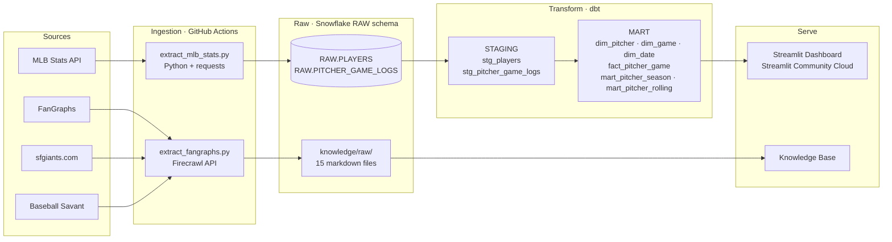

# Baseball Pitching Performance Analytics Pipeline

A end-to-end data analytics pipeline built as a portfolio project targeting a **Baseball Operations Analyst** role with the San Francisco Giants.

## Project Overview

This project demonstrates the full lifecycle of a baseball analytics workflow: ingesting raw MLB pitching data, transforming it into a clean star schema, and surfacing actionable insights through an interactive dashboard. It also builds a Giants-focused knowledge base from press releases and FanGraphs articles.

**Key capabilities:**

- Automated daily ingestion of MLB pitching data via the MLB Stats API
- Multi-layer data transformation (raw → staging → mart) using dbt
- Pitcher performance star schema optimized for analysis
- Interactive Streamlit dashboard for exploring pitching trends
- Knowledge base of summarized Giants and FanGraphs content

## Pipeline Architecture



## Tech Stack


| Layer          | Tool                        |
| -------------- | --------------------------- |
| Data Warehouse | Snowflake                   |
| Transformation | dbt                         |
| Orchestration  | GitHub Actions              |
| Dashboard      | Streamlit (Community Cloud) |
| Data Source    | MLB Stats API               |


## Repo Structure

```
sf-giants-data-analyst/
├── .github/
│   └── workflows/          # GitHub Actions pipeline (scheduled ingestion + dbt runs)
├── dashboard/              # Streamlit app
├── docs/                   # Project proposal and SF Giants job posting
├── knowledge_base/         # Scraped sources and summarized wiki pages
├── models/                 # dbt models
│   ├── raw/                # Raw source models
│   ├── staging/            # Cleaned and typed staging models
│   └── mart/               # Star schema mart models
├── CLAUDE.md               # Project context for AI-assisted development
└── README.md
```

## Portfolio Note

This project was built independently as a portfolio piece to demonstrate data engineering and baseball analytics skills for a Baseball Operations Analyst role at the San Francisco Giants. It reflects real-world practices in modern data stack tooling, MLB data sourcing, and baseball domain knowledge.